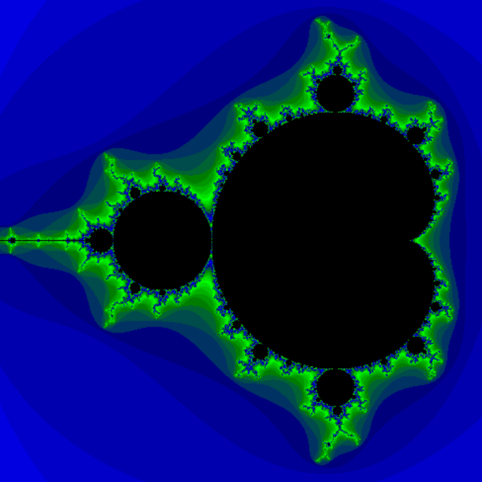

Mandelbrot Explorer
======

A JavaScript based Mandelbrot set explorer, using a Web Worker to calculate the Mandelbrot set.
Click on the canvas to zoom in on that position or use the input fields to explore the fractal.

